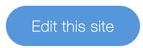

# Build Your Portfolio 

In this workshop, you will build a portfolio website using Corvid by Wix.

**:link: Useful links** 

- [Corvid API Reference](https://www.wix.com/corvid/reference/) covers all of Corvid's APIs. 
- [Corvid Home Page](https://www.wix.com/corvid) contains all Corvid materials.
- [corvid-cli npm package](https://www.npmjs.com/package/corvid-cli) enables you to work in your own local editor.

### Getting started

This workshop is based on a pre-designed [template](https://joshuaa44.wixsite.com/mysite-56).

**:white_check_mark: Step-by-step instructions**

1. Go to this [template](https://editor.wix.com/html/editor/web/renderer/new?siteId=0fb2fc3f-42da-46eb-bad1-86489cdd0598&metaSiteId=d505f92f-04f3-45fc-885b-73f4e38e8096).
2. Click .
3. Sign in to Wix.
4. Let's start having fun!

### modules

This workshop is divided into 9 modules. Each module describes what we're going to build and provides step-by-step insructions to help you implement the architecture and verify your work.

| Module                                                                       | Description                                                               |
| ---------------------------------------------------------------------------- | ------------------------------------------------------------------------- |
| [Create a database collection for projects](docs/PROJECTS_COLLECTION.md)           | Store all the projects in a dedicated collection.                            |
| [Present the projects](docs/PRESENTING_THE_PROJECTS.md)                | Present the projects on the dynamic page |
| [FIlter your projects](docs/FIND_PROJECTS.md)              | Filter your projects based on the category.                                   |
| [Wix Fetch + Sengrid](docs/SENDGRID_API.md) | Set up the contact page.                    |
| [Wix Fetch + Sengrid Part 2](docs/SENGRID_API_PT2.md)                | Send emails with the SendGrid API.           |
| [Wix Fetch + Sengrid Part 3](docs/SENDGRID_API_PT3.md)                                          | Send emails with the SendGrid API cont. 
| [Timeline API](docs/TIMELINE_API.md)                       | Create animations with the timeline API collection.                            |
| [QR code](docs/QR_CODE.md)                                                   | Add a QR code!                                                            |                                                               |
| [Production](docs/PRODUCTION.md)                                                           | Go live.                                                               |

⚠️ These modules are intended to be executed in order.
# Build Your Portfolio 
