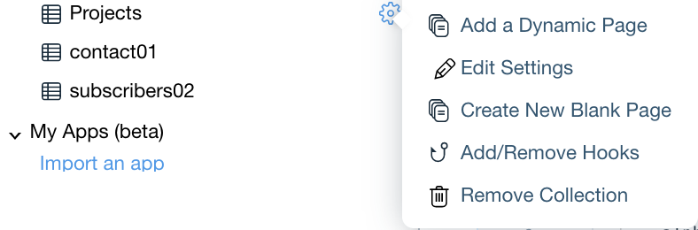
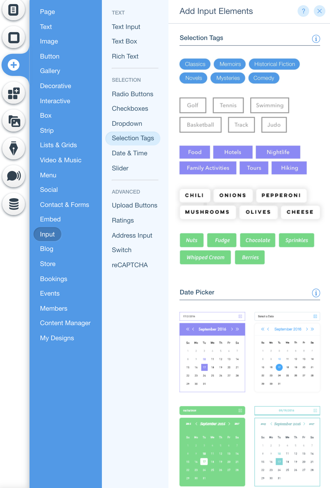
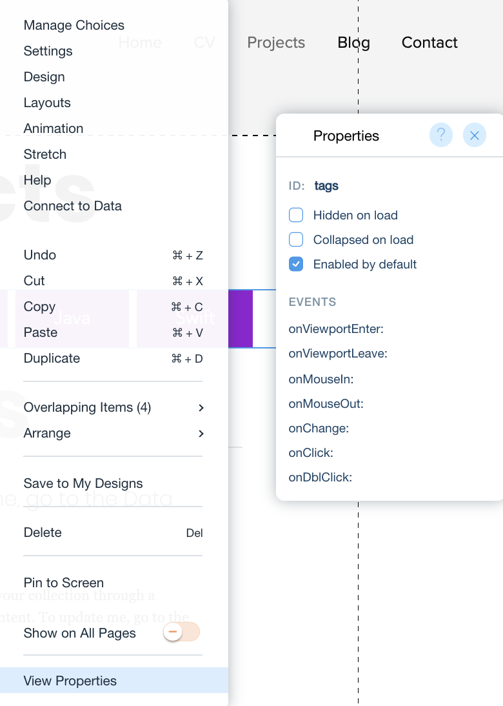
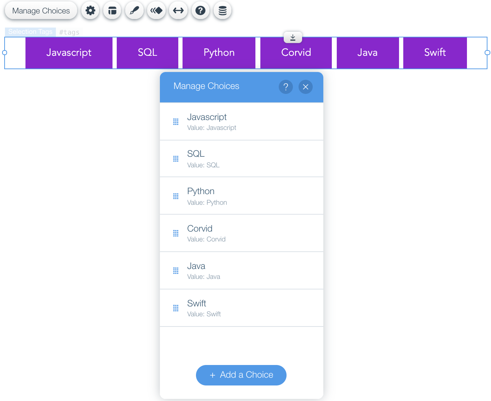
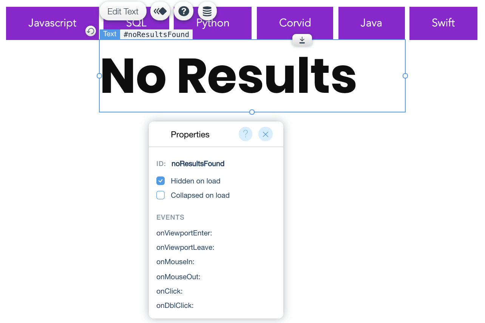

## PRESENT YOUR PROJECTS WITH DYNAMIC PAGES

From the **Site Structure** sidebar on the left, under the **Database** section, hover over the **Project collection** and click the **settings cog**. Next, click **Add a Dynamic Page**.

<p padding="40px"></p>

**Dynamic Pages** Use a single design layout to create unique pages-each with its own content, URL and SEO. Adding Dynamic pages will create a repeater, dataset and unique pages for each project you have stored in the **Project Collection** without writing any code.

**✅ Step-by-step instructions**
****
Lets start from the Projects(All) page.
1. Add a **selection tag** by clicking the  from the vertical menu on the left side of the page. Then click **Input** >> **Selection Tags** and select the element of your liking. <p padding="40px"></p>
 Now that the selection tag is on the page, right click the the selection tags, select View Properties and change the id to 'tags'.
    <p padding="40px"></p>


2. Click the selection tags and select 'Manage Choices'. Change the labels and values to the tags you made in your project collection(programming languages, frameworks, software etc...)
    <p padding="40px"></p>

3. Add a Title to the page and change the text to 'No Results'. Right click the the title, select View Properties and change the id to 'noResultsFound'. Next, select 'Hidden on load'.   <p padding="40px"></p> 
4. Open the IDE and import the wix Data API at the top of the page.

```
import wixData from 'wix-data';
``` 

5. Lets add two variables that will help us out later on in our code. One variable for the collection's name and the other for the field we'll use to filter our data through.
```
const collectionName = 'Projects';
const fieldToFilterByInCollection = 'tags';
```

6. In  ***$w.onReady()***, call a function that will load unfiltered project data to the repeater.
```
$w.onReady(function () {

	loadDataToRepeater()
});
```
7. Add an onChange() event handler to the Selection Tags element. If the selection tags change, run the loadDataToRepeater() function with the selected tags as a parameter:

```
$w.onReady(function () {


	loadDataToRepeater()

	$w('#tags').onChange((event) => {
		const selectedTags = $w('#tags').value
		loadDataToRepeater(selectedTags)
	})
});
```

Awesome! Now let's continue to the next stage: Using Wix Data to find your projects.

⏩  Next Module => [Find Your Projects](FIND_PROJECTS.md)
