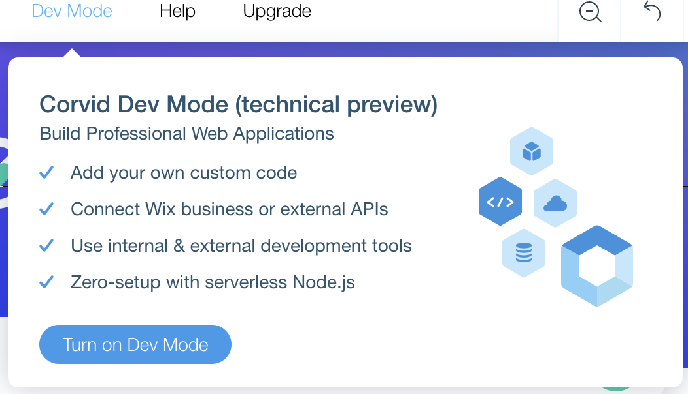
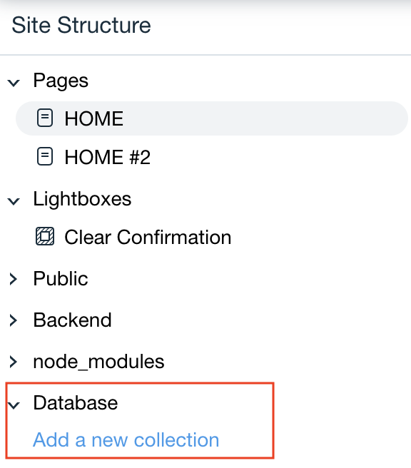
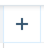
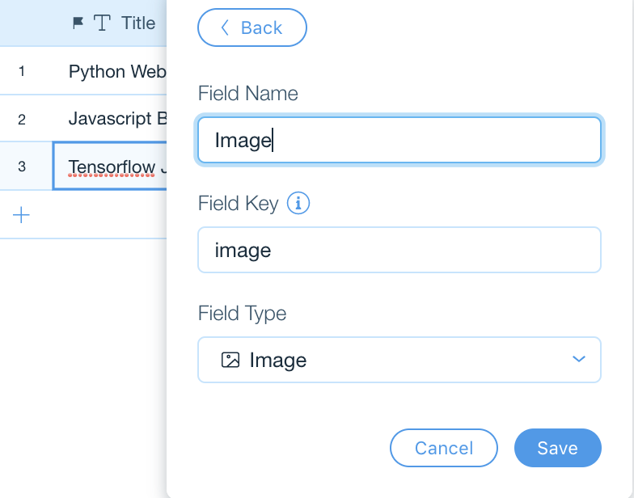
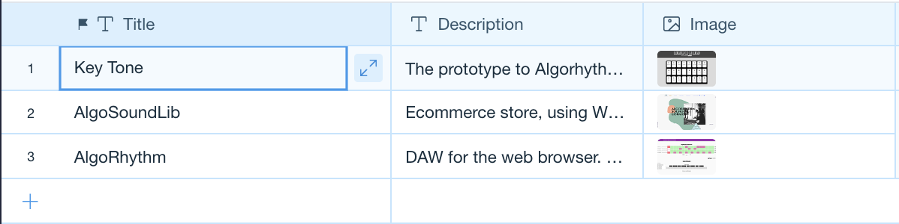

## Create a database collection for tasks

In this module, we'll create a database collection to store your portfolio projects.

 **✅ Step-by-step instructions**

1. From the top bar menu, hover over **Dev Mode** and click **Turn on Dev Mode** to enable Corvid. 

  
2. From the **Site Structure** sidebar on the left, under the **Database** section, click on the **Add a new collection** link. 

3. Click **Start Creating**. In the next panel that opens, click the button on the right, **Create a Collection**.
4. Name the collection **Projects**. Click the **Create Collection** button.
5. A **Title** field will be created by default.  Add more fields by clicking . Name the fields **Description, Image, Tags** and set the Field Types to **text (Description), image (Image) snd tags (Tags)**. Click **Add**. (Add tags you'll use as categories for the next step! i.e Javascript, Python, Azure etc...)

6. Add two items to your new collection 

❗ **We just created a new database collection. In the next module, we'll present its data in our web application.**

⏩ Next Module => [Dynamic Pages](PRESENTING_THE_TASKS.md)
