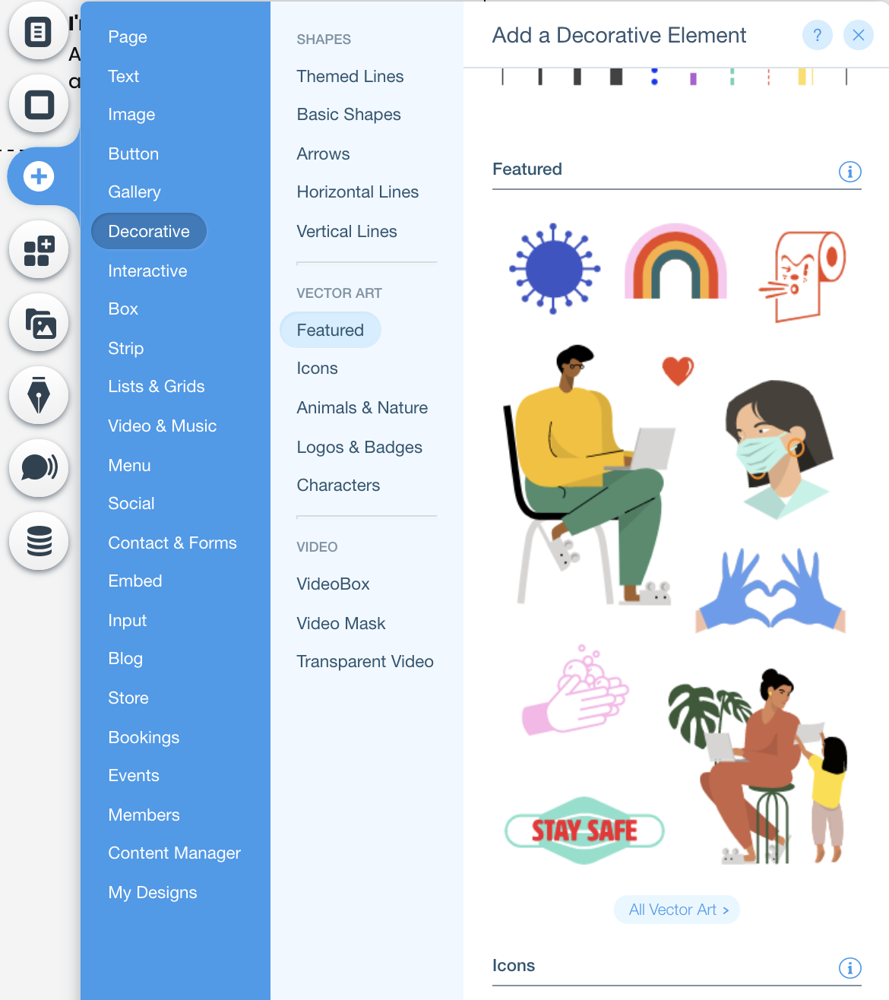

## Animations with the Timeline API
In this module, we'll add a qr code that goes to your site! Use this when you're networking.[QR code](http://goqr.me/api/)


<br>**✅ Step-by-step instructions**


1. Add an image by clicking the  from the vertical menu on the left side of the page. Then click **Image** >> **free wix images/my uploads** and select the image of your liking. <p padding="40px"></p>

    Rename the id of the vector art to 'spinningArt'

2.  Right click the image and select view properties to change the id of the image to qrCode.


3. In the $w.onReady function, select the qrCode element, use .src and set it equal to the QR Code API url
```

$w.onReady(function () {
	$w('#qrCode').src = 'http://api.qrserver.com/v1/create-qr-code/?data=<WIX SITE API>'
	
});

```

❗ **Test it out on preview mode. You should see your QR Code image! You can use this at conferences, and meet ups to give your new connections easy access to your portfolio site.

⏩ BONUS: QR CODE => [Production](PRODUCTION.md)
