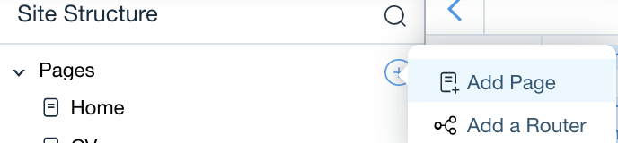

## Wix Fetch + Sengrid!

In this module, we'll use Wix Fetch to integrate the **Sendgrid** API with our portfolios.

**💡 New concepts**

- [Wix Fetch API](https://www.wix.com/corvid/reference/wix-fetch.html) - Fetching resources from 3rd party services using HTTPS.

**⚠️** Make sure to Sign up for [Sengrid](https://sendgrid.com/) and create an API key for the email API. Don't forget to verify your sender email within the sendgrid dashboard.

**✅ Step-by-step directions**
1. Create a new collection called **Contact Form**. In the collection settings window, select **Form Submission** under 'What's this collection for?'. Add new fields for the name, email and message.

 <p padding="40px"></p>


2. Create a new page named Contact.

    <p padding="40px"></p>

3. Add 3 **text inputs** and a **button** elements by clicking  that opens the vertical menu on the left side of the page. Place them where you'd like.
   <p padding="40px"></p>
4. Right click each text input box and the button, select **View Properties** and change the id of each element ***(nameInput, emailInput, messageInput, submitButton)***. 
    <p padding="40px"></p>

****** 
## Back End
5. Add a new js file called **sendGrid.js** by clicking Backend, then select **New .js File**
    <p padding="40px"></p>

6. Import fetch from the [Wix Fetch API](https://www.wix.com/corvid/reference/wix-fetch.html)
```
import {fetch} from 'wix-fetch';  
```
7. Add an export function named sendWithService.
```
import {fetch} from 'wix-fetch';  

export function sendWithService(key, sender, recipient, subject, body) {
  
}
```
8. Add a variable for the required headers and another variable for that stores how the message is formatted.
```
import {fetch} from 'wix-fetch';  

export function sendWithService(key, sender, recipient, subject, body) {
  const url = "https://api.sendgrid.com/api/mail.send.json";
 
  const headers = {
    "Authorization": "Bearer " + key,
    "Content-Type": "application/x-www-form-urlencoded"
  };

  const data = `from=${sender}&to=${recipient}&subject=${subject}&text=${body}`;
 
  
}


```

9. Make a POST request and fetch to the endpoint.
```
import {fetch} from 'wix-fetch';  

export function sendWithService(key, sender, recipient, subject, body) {
  const url = "https://api.sendgrid.com/api/mail.send.json";
 
  const headers = {
    "Authorization": "Bearer " + key,
    "Content-Type": "application/x-www-form-urlencoded"
  };

  const data = `from=${sender}&to=${recipient}&subject=${subject}&text=${body}`;
 
  const request = {
    "method": "post", 
    "headers": headers, 
    "body": data
  };
 
  return fetch(url, request)
   .then(response => response.json());
}

```
⏩ Next Module => [Sengrid Part 2](SENGRID_API_PT2.md)
