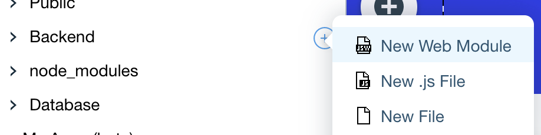
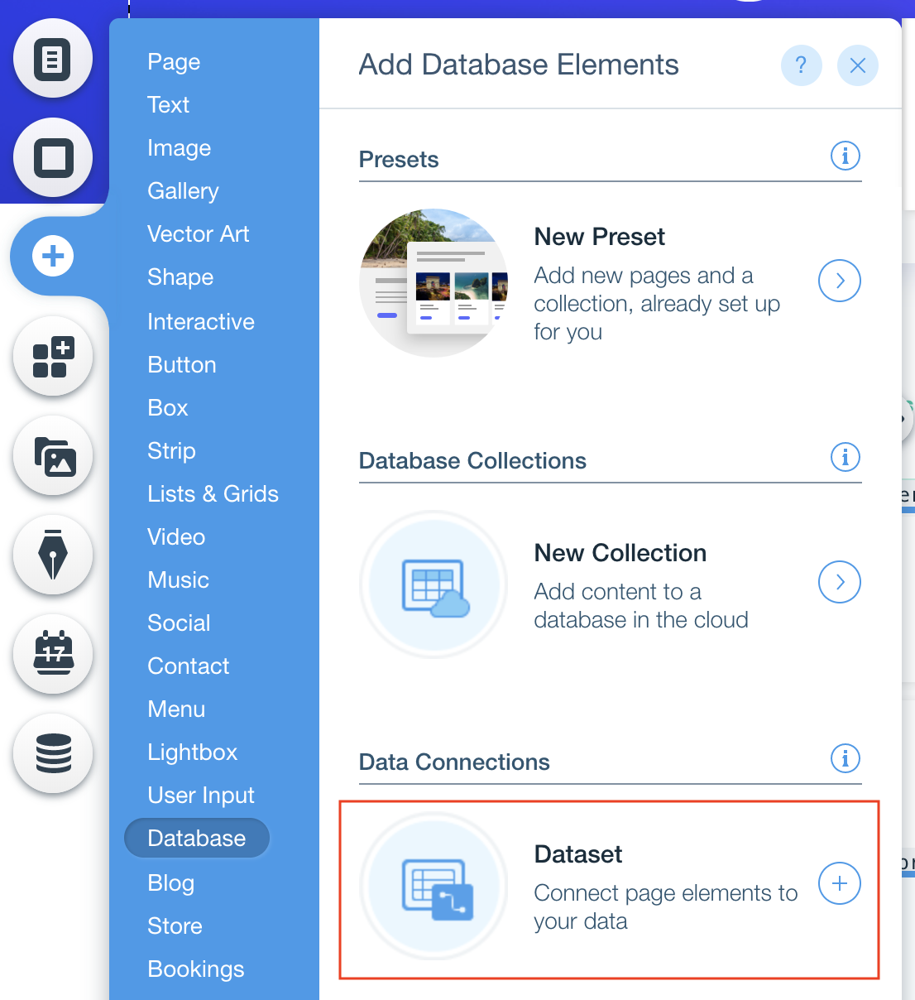
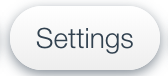
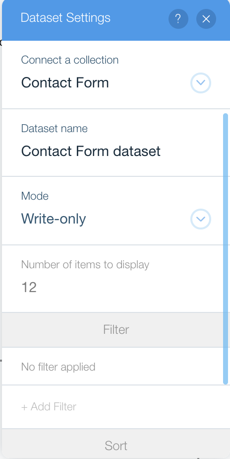
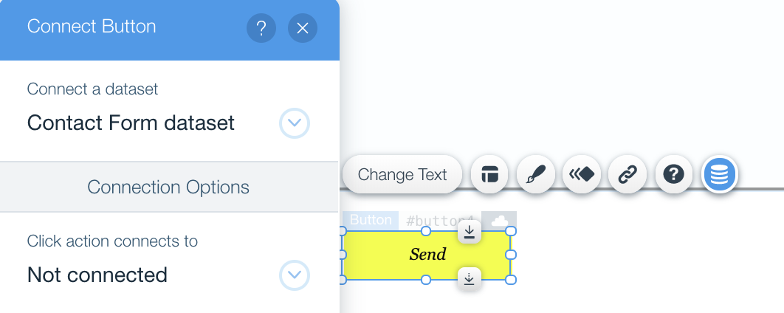

## Wix Fetch + Sengrid PT 2! 

1. Add a new jws file called **email.jsw** by clicking **New Web Module** in the Site Structure panel.

   <p padding="40px"></p>

2. Remove the template code and import the **sendWithService** function from **sendGrid.jsw**
```
import { sendWithService } from 'backend/sendGrid';
```

3. Add a new export function called **sendEmail**.
```
import {sendWithService} from 'backend/sendGrid';

export  function sendEmail(subject, body) {
  const key = <YOUR API KEY>
  const sender = <VERIFIED SENDER EMAIL>;
  	const recipient = <RECIPIENT EMAIL>;
  return sendWithService(key, sender, recipient, subject, body);
}
```


4. Add another function to send an email to the user that is filling the
```
import { sendWithService } from 'backend/sendGrid';

export function sendEmail(subject, body) {
	const key = <API KEY>;
	const sender = <VERIFIED SENDER EMAIL>;
	const recipient = <RECIPIENT EMAIL>;
	return sendWithService(key, sender, recipient, subject, body);
}

export function sendEmailWithRecipient(subject, body, recipient) {
	const key = <API KEY>;
	const sender = <VERIFIED SENDER EMAIL>;
	return sendWithService(key, sender, recipient, subject, body);
}

```

******
## FRONT END


5. Navigate back to the Contact page and add a [dataset](https://www.wix.com/corvid/reference/wix-dataset.html) by clicking the  from the vertical menu on the left side of the page. Then click **Database** >> **Dataset**. <p padding="40px"></p>
6. Click  to access the Dataset Settings.
7. Connect the **Contact Form** collection to the dataset. <br>Set the mode to **Write-Only**. <p padding="40px"></p>
8. Connect the input boxes to the dataset by clicking the **Connect Button** and select the appropriate field for each input box. . Then connect the Button and select **Submit** under the 'Click action connects to' dropdown <p padding="40px"></p>

Great! Now let's continue to the next stage: Sendgrid + Front end! 


⏩ Next Module => [Sendgrid Part 3](SENDGRID_API_PT3.md)
