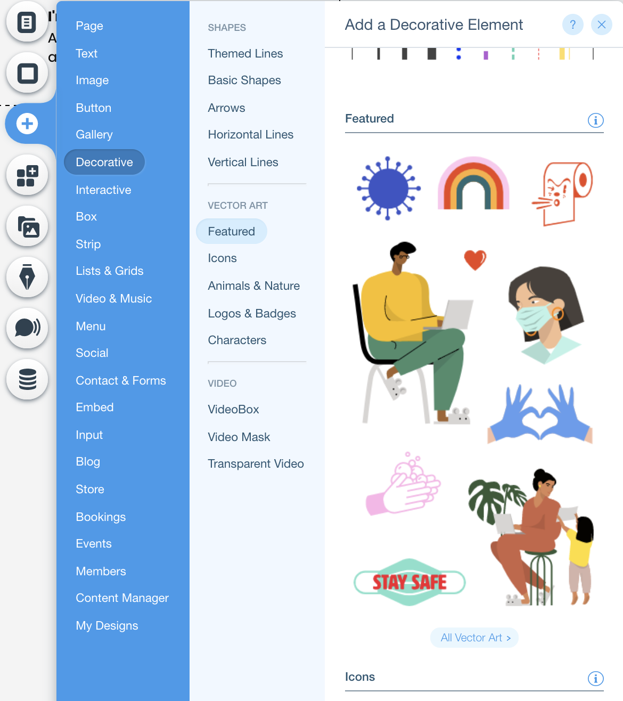

## Animations with the Timeline API
In this module, we'll make animations using the [Timeline API](https://www.wix.com/corvid/reference/wix-animations.html)

<p padding="40px"></p>  

<br>**✅ Step-by-step instructions**


1. Choose a page you'd like to add animation to. Add **Vector Art** by clicking the  from the vertical menu on the left side of the page. Then click **Decorative** >> **All Vector Art** and select the element of your liking. <p padding="40px"></p>

    Rename the id of the vector art to 'spinningArt'

2.  Open the IDE and import wix animations.
```
import { timeline } from "wix-animations"
import wixAnimations from 'wix-animations';
```

3. Add a function named **spinAnimation** and call it in the $w.onReady function to start the animation on page load.
```
import { timeline } from "wix-animations"
import wixAnimations from 'wix-animations';

$w.onReady(function () {
	techAnimation();
	
});

function techAnimation() {
	const timeline2 = wixAnimations.timeline({ "repeat": -1 })//play animation on repeat
		.add($w('#boxSpin'), {
			"rotate": 360,//rotate in circle
			"duration": 5000,
			"easing": "easeInCirc"//The animation motion acceleration or deceleration.
		})
	timeline2.replay()

}
```

❗ **We just created an animation using javascript! Have fun and be creative with this API.**

⏩ BONUS: QR CODE => [Add A QR Code](QR_CODE.md)
